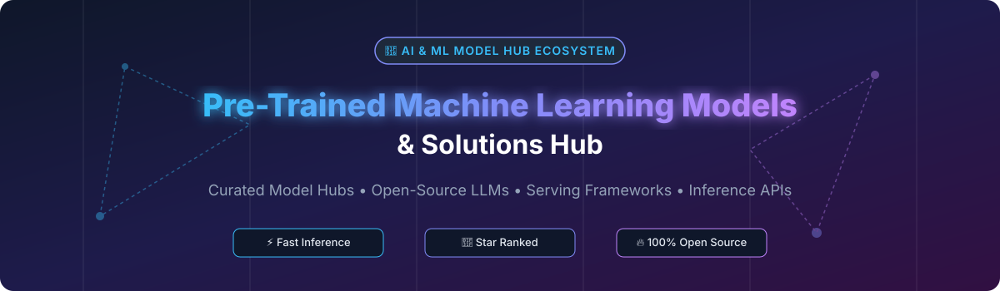

  

# 🚀 Awesome Pre-Trained Machine Learning Models & Solutions Hub

  
  
  
  
  

## 📌 Top Pre-Trained Machine Learning Models & Solutions Hub Ecosystem

**Curated List of SaaS Products & Open-Source GitHub Projects**  
*Focused on Model Hubs, LLM Inference Platforms, Self-Hosted Serving & Foundation Models*  

📅 **Last updated: October 2026**

Welcome to the **Awesome Pre-Trained Machine Learning Models & Solutions Hub**! This repository tracks premier **commercial model hubs, cloud inference platforms**, and **open-source GitHub repositories** that provide state-of-the-art pre-trained AI models — spanning Large Language Models (LLMs), Computer Vision, Speech, Multimodal AI, and specialized machine learning pipelines for high-throughput production deployment and local self-hosting.

### 🌟 Key Highlights & Ecosystem Examples
- **Commercial & Enterprise Platforms**: Amazon SageMaker JumpStart, Hugging Face Model Hub, Google Cloud Model Garden, Azure AI Studio Model Catalog, Replicate, Together AI, DeepInfra, Fal.ai, Clarifai Community, and Lepton AI.
- **Open-Source Standard Bearers**: **Hugging Face Transformers**, **Diffusers**, **vLLM**, **Ollama**, **llama.cpp**, **TGI**, **KServe**, **MLflow**, **BentoML**, **LocalAI**, **Ray Serve**, and **SGLang**.

---

## 📑 Table of Contents
- [🏢 SaaS & Hosted Platforms](#-saas--hosted-platforms)
- [🔓 Open-Source GitHub Projects](#-open-source-github-projects)
  - [📦 Model Libraries & Hubs](#-model-libraries--hubs)
  - [⚡ Inference & Serving Engines](#-inference--serving-engines)
  - [🛠️ Model Serving Frameworks](#-model-serving-frameworks)
  - [📊 Evaluation & Benchmarking](#-evaluation--benchmarking)
  - [🧰 Fine-Tuning & Utility Tools](#-fine-tuning--utility-tools)
- [🤝 How to Contribute](#-how-to-contribute)
- [📜 Disclaimer](#-disclaimer)
- [📈 Star History](#-star-history)
- [💖 Support & Community](#-support--community)

---

## 🏢 SaaS & Hosted Platforms

> 📊 **Market Size & Industry Dynamics**:  
> The global **AI Infrastructure and Model Inference SaaS market** is estimated at **~$50 Billion+** (2026) and is projected to surpass **$200 Billion** by 2030, driven by widespread enterprise adoption of LLMs and generative AI workloads.  
> 💡 **Market Structure**: The market exhibits a **moderately fragmented to tier-concentrated (winner-takes-most)** structure. Hyperscaler cloud platforms (Microsoft Azure, AWS, Google Cloud) dominate enterprise infrastructure, while specialized LLM API providers (Hugging Face, Together AI, Replicate) capture high-growth developer and generative AI niches.

| Company / Product | Valuation / Revenue / Market Cap | Description | Best For |
| :--- | :--- | :--- | :--- |
| **[Azure AI Studio Model Catalog](https://azure.microsoft.com/en-us/products/ai-studio)** | ~$3.0 Trillion (Microsoft Market Cap) | **Microsoft's model catalog** — foundation models from OpenAI, Meta, Mistral, and more. | **Best for Azure-native model deployment** |
| **[Amazon SageMaker JumpStart](https://aws.amazon.com/sagemaker/jumpstart/)** | ~$2.0 Trillion (AWS Market Cap) | **AWS's model hub** — pre-trained models and solutions deployable to SageMaker. | **Best for AWS-native model deployment** |
| **[Google Cloud Model Garden](https://cloud.google.com/model-garden)** | ~$2.0 Trillion (Alphabet Market Cap) | **Google's model hub** — foundation models and task-specific models on Vertex AI. | **Best for GCP-native model deployment** |
| **[Hugging Face Model Hub](https://huggingface.co/models)** | $4.5 Billion (Valuation) | **The largest open model hub** — 1M+ models across NLP, vision, audio, and multimodal. | **Best for accessing pre-trained models** |
| **[Together AI](https://www.together.ai/)** | $1.25 Billion (Valuation) | **Fast inference for open-source models** — Llama, Mistral, and more with optimized inference. | **Best for production inference** |
| **[Clarifai Community](https://www.clarifai.com/)** | ~$500 Million (Valuation) | **AI model platform** — pre-trained models for vision, NLP, and enterprise applications. | **Best for enterprise AI** |
| **[Fal.ai](https://fal.ai/)** | ~$100 Million+ (Valuation / Raised) | **Generative media model inference** — real-time image, video, and audio models. | **Best for creative AI applications** |
| **[Replicate](https://replicate.com/)** | ~$100 Million+ (Valuation) | **Run open-source models via API** — thousands of models with pay-per-use pricing. | **Best for quick model inference** |
| **[Lepton AI](https://www.lepton.ai/)** | ~$50 Million+ (Valuation / Raised) | **AI inference platform** — deploy and serve open models with developer efficiency. | **Best for developer-friendly inference** |
| **[DeepInfra](https://deepinfra.com/)** | ~$10 Million+ (Est. Valuation / Raised) | **Serverless inference for open models** — scale-to-zero, pay-per-token pricing. | **Best for cost-effective inference** |

---

## 🔓 Open-Source GitHub Projects

### 📦 Model Libraries & Hubs

- **[Hugging Face Transformers](https://github.com/huggingface/transformers)**   
  **The de facto standard for pre-trained NLP models**, Apache-2.0 licensed. **Thousands of pre-trained models** for text, vision, audio, and multimodal tasks. **PyTorch, TensorFlow, and JAX support**. **Best for accessing pre-trained models**.

- **[Hugging Face Diffusers](https://github.com/huggingface/diffusers)**   
  **State-of-the-art diffusion models for image and audio generation**, Apache-2.0 licensed. **Stable Diffusion, DALL-E, and generative pipelines**. **Best for generative AI**.

- **[Hugging Face Hub](https://github.com/huggingface/huggingface_hub)**   
  **Client library for Hugging Face Hub**, Apache-2.0 licensed. **Download and upload models, datasets, and spaces programmatically**. **Best for model hub integration**.

- **[ONNX Model Zoo](https://github.com/onnx/models)**   
  **Pre-trained ONNX models**, Apache-2.0 licensed. **Cross-platform open format for deep learning models**. **Best for model interoperability**.

- **[TensorFlow Hub](https://github.com/tensorflow/hub)**   
  **TensorFlow's repository of reusable machine learning modules**, Apache-2.0 licensed. **Best for TensorFlow users**.

- **[PyTorch Hub](https://github.com/pytorch/hub)**   
  **PyTorch's model hub**, BSD-3-Clause licensed. **Pre-trained PyTorch models publishing platform**. **Best for PyTorch users**.

- **[Model Zoo](https://github.com/model-zoo)**  
  **Community hub for discovery of pre-trained deep learning models** across various frameworks.

---

### ⚡ Inference & Serving Engines

- **[Ollama](https://github.com/ollama/ollama)**   
  **The simplest way to run local LLMs**, MIT licensed. **One-command model execution** for Llama, Mistral, Gemma, Phi, and dozens more. **Best for local model inference**.

- **[llama.cpp](https://github.com/ggerganov/llama.cpp)**   
  **LLM inference in C/C++**, MIT licensed. **Runs efficiently on CPU and GPU with 4-bit/8-bit quantization**. **Best for low-resource LLM inference**.

- **[vLLM](https://github.com/vllm-project/vllm)**   
  **High-throughput and memory-efficient LLM serving engine**, Apache-2.0 licensed. **PagedAttention memory management with continuous batching**. **Best for production LLM inference**.

- **[LocalAI](https://github.com/mudler/LocalAI)**   
  **OpenAI-compatible REST API for local model inference**, MIT licensed. **Drop-in replacement for OpenAI API without GPU requirement**. **Best for self-hosted OpenAI compatibility**.

- **[SGLang](https://github.com/sgl-project/sglang)**   
  **Fast serving framework for Large Language Models and Vision-Language Models**, Apache-2.0 licensed. **RadixAttention for context reuse**. **Best for high-speed LLM & VLM inference**.

- **[Text Generation Inference (TGI)](https://github.com/huggingface/text-generation-inference)**   
  **Hugging Face's enterprise inference server**, Apache-2.0 licensed. **Production-grade LLM serving with token streaming**. **Best for Hugging Face model serving**.

- **[OpenLLM](https://github.com/bentoml/OpenLLM)**   
  **Run any open-source LLM as OpenAI-compatible API**, Apache-2.0 licensed. **BentoML-based flexible serving engine**. **Best for LLM deployment**.

- **[KServe](https://github.com/kserve/kserve)**   
  **Kubernetes-native serverless model serving**, Apache-2.0 licensed. **Autoscaling inference workloads on Kubernetes**. **Best for Kubernetes model serving**.

- **[TensorRT-LLM](https://github.com/NVIDIA/TensorRT-LLM)**   
  **NVIDIA's library for compiling and optimizing LLM inference**, Apache-2.0 licensed. **Maximum GPU throughput**. **Best for NVIDIA GPU optimization**.

- **[Ray Serve](https://github.com/ray-project/ray)**   
  **Scalable programmable model serving framework on Ray**, Apache-2.0 licensed. **Distributed model pipelines**. **Best for multi-model distributed serving**.

---

### 🛠️ Model Serving Frameworks

- **[MLflow](https://github.com/mlflow/mlflow)**   
  **Open source platform for the machine learning lifecycle**, Apache-2.0 licensed. **Model tracking, packaging, registry, and serving**. **Best for end-to-end ML lifecycle**.

- **[NVIDIA Triton Inference Server](https://github.com/triton-inference-server/server)**   
  **Multi-framework enterprise inference server**, BSD-3-Clause licensed. **Supports TensorFlow, PyTorch, ONNX, and TensorRT**. **Best for multi-framework enterprise serving**.

- **[BentoML](https://github.com/bentoml/BentoML)**   
  **Unified framework for building and scaling AI applications**, Apache-2.0 licensed. **Standardized packaging and cloud deployment**. **Best for production AI services**.

- **[TensorFlow Serving](https://github.com/tensorflow/serving)**   
  **Flexible high-performance ML serving system**, Apache-2.0 licensed. **Designed for production environments**. **Best for TensorFlow models**.

- **[TorchServe](https://github.com/pytorch/serve)**   
  **Flexible and easy to use tool for serving PyTorch models**, Apache-2.0 licensed. **Production-grade PyTorch deployment**. **Best for PyTorch models**.

---

### 📊 Evaluation & Benchmarking

- **[LMSYS FastChat / Chatbot Arena](https://github.com/lm-sys/FastChat)**   
  **An open platform for training, serving, and evaluating LLM chatbots**, Apache-2.0 licensed. **Powers LMSYS Chatbot Arena**. **Best for crowdsourced LLM evaluation**.

- **[EleutherAI LM Evaluation Harness](https://github.com/EleutherAI/lm-evaluation-harness)**   
  **A framework for zero-shot and few-shot LLM evaluation**, MIT licensed. **Standardized benchmark suite**. **Best for LLM benchmarking**.

- **[HELM (Holistic Evaluation of Language Models)](https://github.com/stanford-crfm/helm)**   
  **Stanford CRFM's comprehensive benchmark framework**, Apache-2.0 licensed. **Multidimensional evaluation of LLM capabilities**. **Best for academic and rigorous testing**.

- **[Open LLM Leaderboard](https://github.com/huggingface/open-llm-leaderboard)**   
  **Hugging Face's official benchmark tracking system for open LLMs**, Apache-2.0 licensed. **Best for model performance ranking**.

---

### 🧰 Fine-Tuning & Utility Tools

- **[Hugging Face PEFT](https://github.com/huggingface/peft)**  — Parameter-Efficient Fine-Tuning (LoRA, QLoRA, Prefix Tuning).
- **[Hugging Face Accelerate](https://github.com/huggingface/accelerate)**  — Easy multi-GPU / TPU distributed training.
- **[Hugging Face Datasets](https://github.com/huggingface/datasets)**  — Lightweight access and sharing for machine learning datasets.
- **[Gradio](https://github.com/gradio-app/gradio)**  — Build & share delightful web apps for your machine learning models.
- **[Streamlit](https://github.com/streamlit/streamlit)**  — Faster way to build data and AI apps.
- **[Weights & Biases (wandb)](https://github.com/wandb/wandb)**  — Developer tools for ML experiment tracking and model evaluation.
- **[DVC (Data Version Control)](https://github.com/iterative/dvc)**  — Data & model version management for ML projects.

---

## 🤝 How to Contribute

Contributions are welcome and appreciated! Follow these steps to submit additions or updates:

1. **Fork** the repository on GitHub.
2. **Add/Edit** entries in `README.md` maintaining the existing table or list formatting.
3. Ensure the project provides **pre-trained models, inference infrastructure, or serving capabilities**.
4. Open a **Pull Request (PR)** with a clear title and brief description.

---

## 📜 Disclaimer

- This list is **community-curated** for informational and educational purposes.
- Pre-trained models come with distinct licenses (e.g., Apache-2.0, MIT, Llama Community License). **Always verify licensing compliance** before commercial deployment.
- High-throughput LLM inference requires proper hardware planning (GPU VRAM allocation, quantization, memory bandwidth).

---

## 📈 Star History

---

## 💖 Support & Community

Thank you for exploring and using **Awesome Pre-Trained Machine Learning Models & Solutions Hub**! If you find this curated list valuable for your AI projects, please consider:
- 🌟 **Starring** this repository on GitHub
- 🔀 **Forking** and contributing new tools or fixes
- 📢 **Sharing** it with fellow ML engineers, AI researchers, and developers

☕ **Sponsor & Buy Me a Coffee**:  
If you'd like to support the ongoing maintenance of this awesome ecosystem list, feel free to visit the [GitHub Sponsor Dashboard](https://github.com/sponsors/ishandutta2007).

---

  <b>Curated with ❤️ for the global Open-Source AI and Machine Learning Community.</b>

